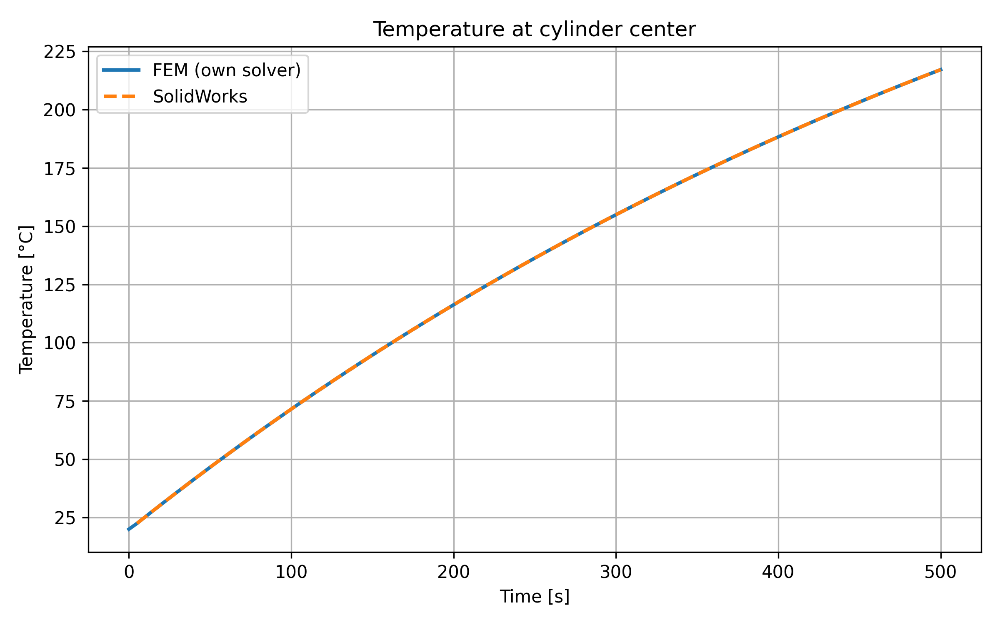

# Validation Case 1 – SolidWorks Comparison

## Objective

The objective of this validation case is to verify the correctness of the implemented FEM solver for transient heat conduction by comparing its results with a reference solution obtained using SolidWorks Simulation.

---

## Problem Description

A cylindrical sample is heated through convection on its outer surface. The temperature evolution at the center of the cylinder is monitored over time.

---

## Geometry

- Radius: 0.02 m  
- Height: 0.05 m  
- Axisymmetric model  

---

## Material Properties

- Density: 1700 kg/m³  
- Specific heat: 1000 J/(kg·K)  
- Thermal conductivity: 160 W/(m·K)  

(Material based on magnesium alloy)

---

## Initial Condition

- Initial temperature: 20°C  

---

## Boundary Conditions

- Convection applied on:
  - outer cylindrical surface (r = R)

- Convection parameters:
  - Heat transfer coefficient: α = 25 W/(m²·K)  
  - Ambient temperature: 400°C  

- Remaining boundaries:
  - Adiabatic (insulated)

---

## Time Discretization

- Total simulation time: 500 s  
- Time step: 10 s  

---

## Numerical Model (FEM)

- Method: Finite Element Method  
- Formulation: axisymmetric  
- Time integration: implicit scheme  
- Mesh: 20 × 40 (radial × axial)  

---

## Reference Solution

Reference results were obtained using SolidWorks Simulation with equivalent geometry, material properties, boundary conditions, and time settings.

---

## Results

The temperature at the center of the cylinder was compared between:

- FEM solver (this project)  
- SolidWorks Simulation  

The comparison is shown in the figure below:

---

## Error Analysis

| Metric        | Value        |
|--------------|-------------|
| Max error    | 0.005 °C    |
| Mean error   | 0.002 °C    |

---

## Discussion

The obtained results show an almost perfect agreement between the implemented FEM solver and the reference solution from SolidWorks.

The negligible error confirms:

- correct implementation of the FEM formulation  
- proper handling of axisymmetric terms  
- correct application of boundary conditions  
- stable and accurate time integration  

---

## Conclusion

The FEM solver has been successfully validated against a commercial reference solution. The high level of agreement confirms that the implementation is correct and can be reliably used for further development, including nonlinear simulations and real-time applications.