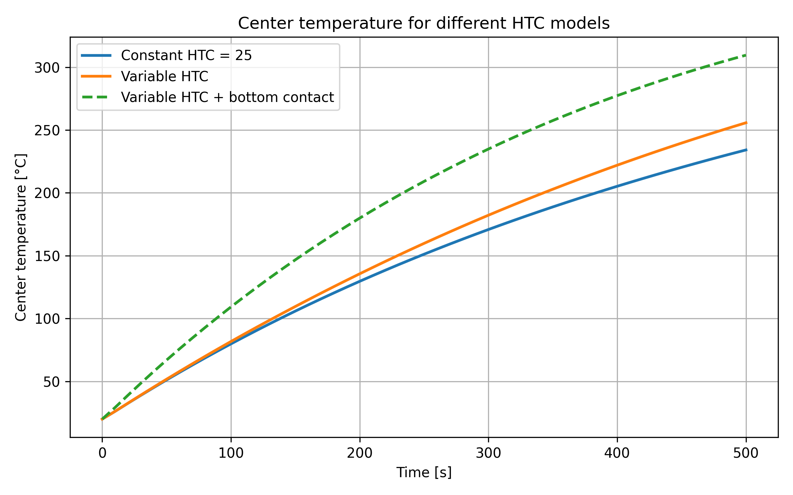
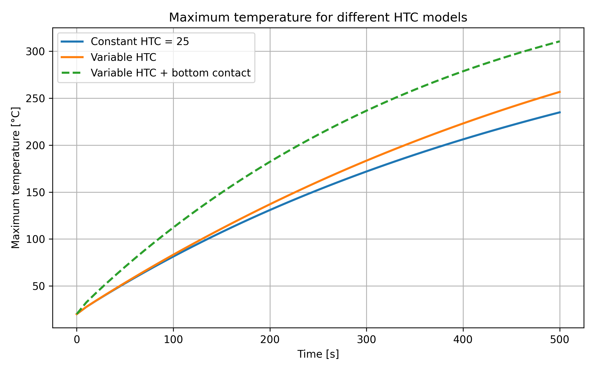
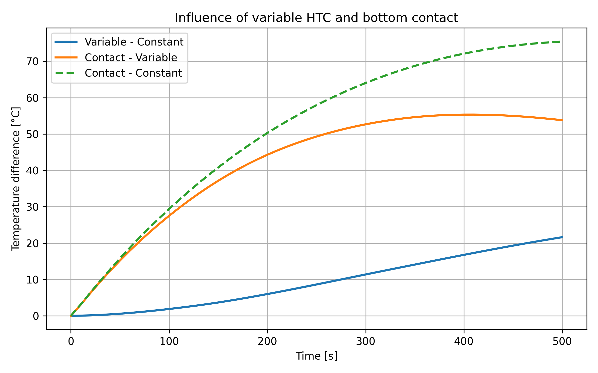

# HTC Model Check

## Objective

The objective of this test is to verify the behavior of the implemented effective heat transfer coefficient (HTC) model.

The solver now supports:

- constant HTC,
- temperature-dependent HTC,
- different HTC models assigned to different boundary sides.

The purpose of this study is to evaluate the influence of boundary heat transfer conditions on the predicted heating process.

---

## Tested Cases

Three cases were compared:

| Case | Top boundary | Right boundary | Bottom boundary |
|------|--------------|----------------|-----------------|
| Constant HTC | 25 | 25 | none |
| Variable HTC | h(Ts) | h(Ts) | none |
| Variable HTC + contact | h(Ts) | h(Ts) | 80 |

where `Ts` is the current surface temperature at the boundary Gauss point.

---

## Variable HTC Data

The temperature-dependent HTC model was defined using tabulated data:

| Surface temperature [°C] | HTC [W/(m²K)] |
|--------------------------|--------------:|
| 20 | 25 |
| 100 | 27 |
| 200 | 31 |
| 300 | 36 |
| 400 | 42 |

Values between tabulated points are obtained using linear interpolation.

---

## Results

### Center Temperature

### Maximum Temperature

### Temperature Differences

---

## Numerical Results

| Quantity | Value |
|----------|-------:|
| Final center temperature (constant HTC) | 234.133 °C |
| Final center temperature (variable HTC) | 255.755 °C |
| Final center temperature (variable HTC + contact) | 309.547 °C |
| Variable - constant difference | 21.622 °C |
| Contact - variable difference | 53.792 °C |
| Contact - constant difference | 75.414 °C |

---

## Discussion

The results show a strong influence of boundary conditions on the predicted heating process.

The temperature-dependent HTC model produces higher temperatures than the constant HTC case. This behavior is physically consistent because the effective heat transfer coefficient increases with surface temperature, resulting in stronger heat exchange between the furnace environment and the sample.

The additional bottom contact condition significantly increases the predicted temperature. This demonstrates that heat transfer through contact surfaces may strongly affect the heating process and should be carefully considered during experimental validation.

The obtained results indicate that accurate boundary condition modelling is one of the most important aspects of the simulation.

The smooth and monotonic temperature evolution confirms stable behavior of the nonlinear solver and the implemented HTC model.

---

## Conclusion

The implemented effective HTC model behaves consistently with physical expectations.

The study confirms that the solver can correctly represent:

- constant convection-type boundary conditions,
- temperature-dependent effective HTC,
- additional heat transfer through contact surfaces.

The results also demonstrate that boundary conditions have a dominant influence on the predicted temperature field.

This provides a flexible and physically consistent framework for future experimental validation and realtime simulation.