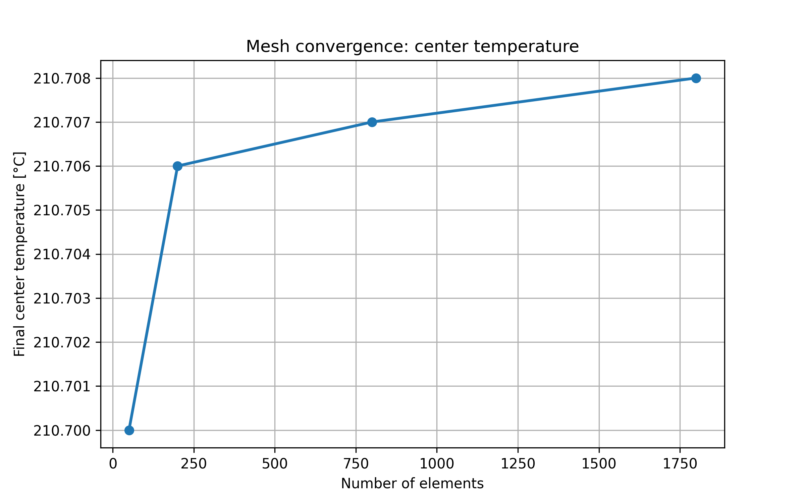
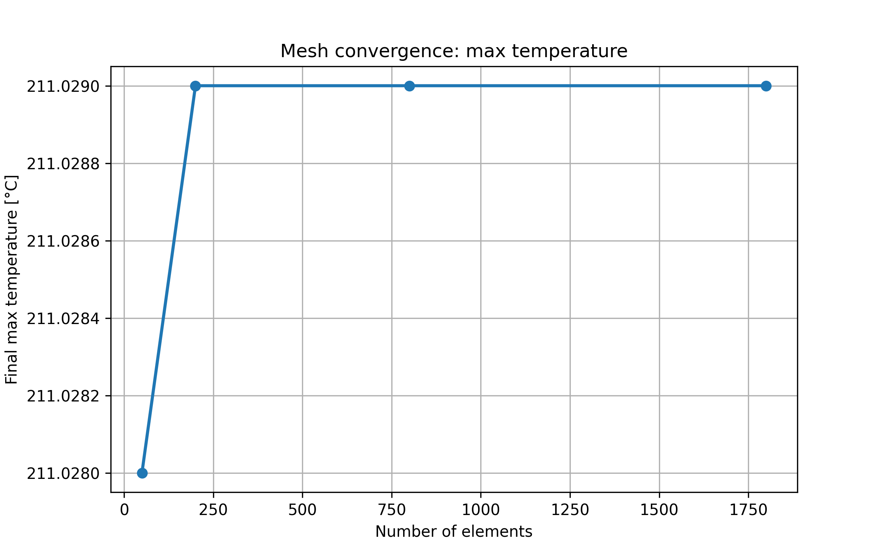
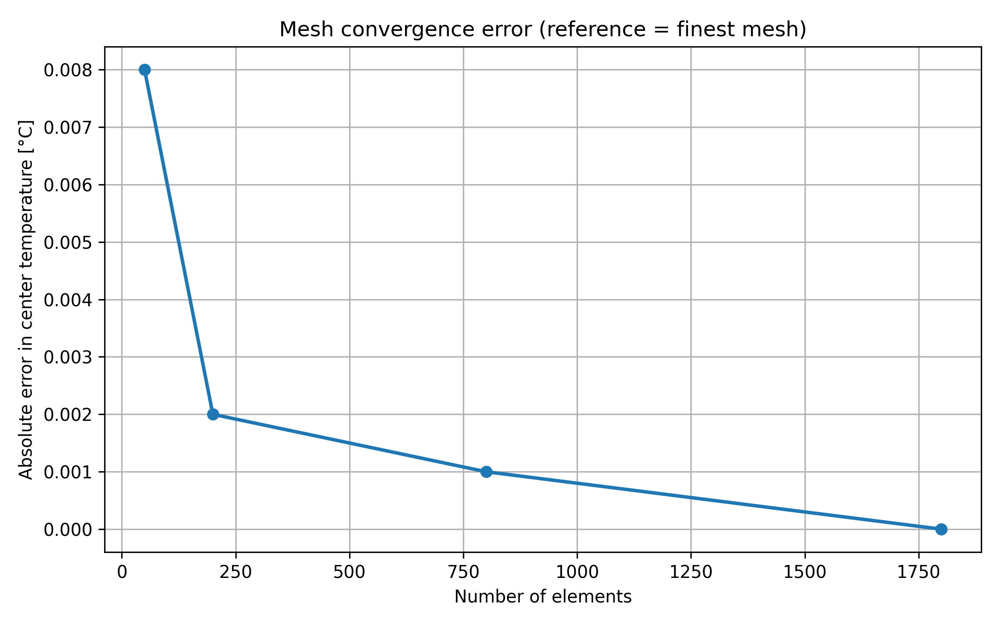

# Mesh Convergence Study

## Objective

The objective of this study is to evaluate the sensitivity of the numerical solution to mesh density and to determine whether the solution becomes effectively mesh-independent for the selected discretization.

---

## Problem Setup

The simulations were performed for the same transient heat conduction case using three structured meshes:

| Mesh   | Nodes | Elements |
|--------|------:|---------:|
| 5x10   | 66    | 50       |
| 10x20  | 231   | 200      |
| 20x40  | 861   | 800      |
| 30x60  | 1891  | 1800     |

Common simulation settings:

- axisymmetric cylindrical domain
- transient heat conduction
- nonlinear material model
- total simulation time: 500 s
- time step: 10 s
- convection on the outer cylindrical surface
- same initial and boundary conditions for all cases

---

## Compared Quantities

The following quantities were used to assess mesh convergence:

- final temperature at the center of the cylinder
- final maximum temperature in the domain

The finest mesh (30x60) was used as the reference solution.

---

## Results

### Final center temperature

### Final maximum temperature

### Error relative to the finest mesh

---

## Discussion

The results demonstrate clear convergence of the solution with increasing mesh density.

Key observations:

- The coarsest mesh (5x10) introduces a small but noticeable error (~0.008 °C)
- Refinement to 10x20 significantly reduces the error (~0.002 °C)
- Further refinement produces negligible changes (<0.001 °C)

The solution exhibits smooth convergence behavior.

---

## Conclusion

The solution can be considered mesh-independent for meshes of size 20x40 and finer.

Even relatively coarse meshes (10x20) provide very good accuracy with minimal error.

Therefore:

- 10x20 is sufficient for fast simulations (e.g. real-time mode)
- 20x40 provides a good balance between accuracy and cost
- 30x60 can be treated as a reference solution

This confirms the numerical stability and reliability of the solver.