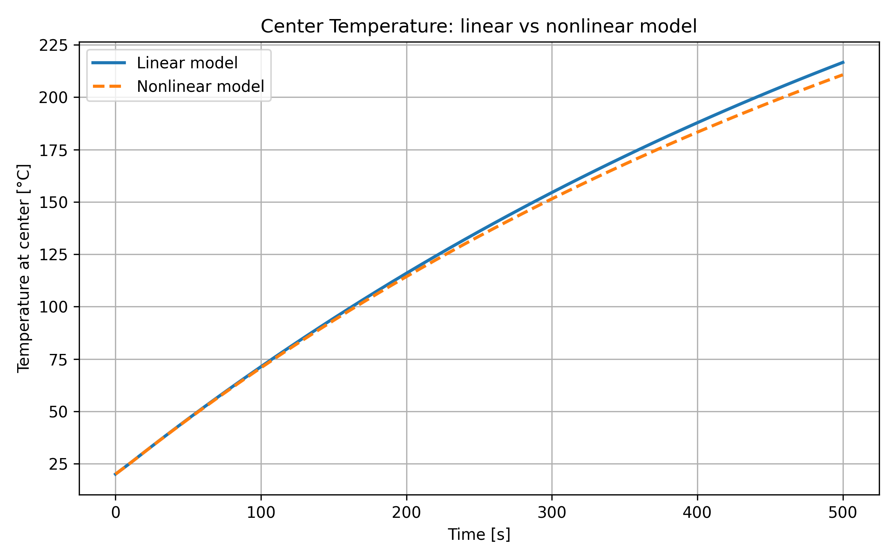
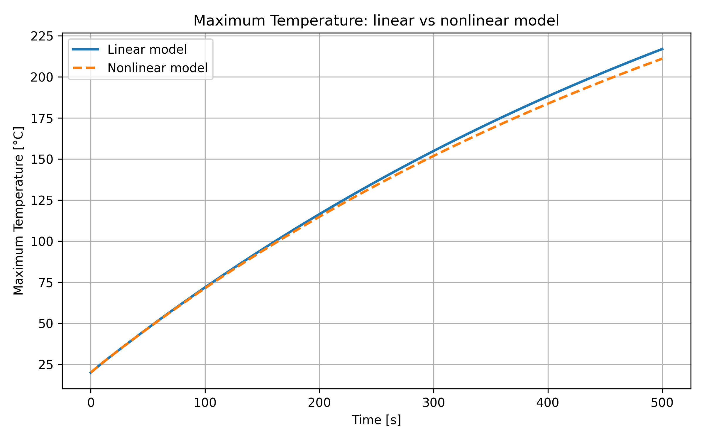
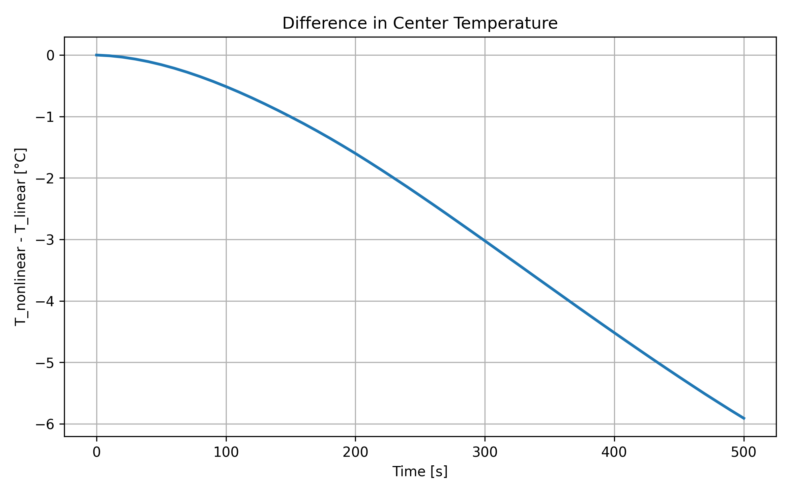

# Nonlinear Material Model Comparison

## Objective

The objective of this case is to compare the transient heating response obtained with:

- a linear material model with constant thermal properties,
- a nonlinear material model with temperature-dependent conductivity and specific heat.

---

## Geometry

- Radius: 0.02 m
- Height: 0.05 m
- Axisymmetric model

---

## Mesh

- Structured mesh: 20 × 40

---

## Initial Condition

- Initial temperature: 20°C

---

## Boundary Conditions

- Convection applied on the outer cylindrical surface (r = R)
- Heat transfer coefficient: α = 25 W/(m²·K)
- Ambient temperature: 400°C
- Remaining boundaries: adiabatic

---

## Time Discretization

- Total simulation time: 500 s
- Time step: 10 s

---

## Material Models

### Linear model
- Density: 1700 kg/m³
- Thermal conductivity: 160 W/(m·K)
- Specific heat: 1000 J/(kg·K)

### Nonlinear model
- Density: constant
- Thermal conductivity: k(T)
- Specific heat: c(T)
- Material data loaded from CSV table (_**magnesium_alloy.csv**_)

---

## Compared Quantities

The following quantities were compared:

- temperature at the center of the cylinder,
- maximum temperature in the domain,
- difference between linear and nonlinear center temperatures.

---

## Results

### Center temperature

### Maximum temperature

### Difference in center temperature

---

## Quantitative Results

- Max center temperature difference: 5.909 °C
- Mean center temperature difference: 2.511 °C
- Final center temperature difference: -5.909 °C

- Max Tmax difference: 5.874 °C
- Mean Tmax difference: 2.490 °C

---

## Discussion

The nonlinear model modifies the heating dynamics due to the temperature dependence of material properties. In particular, the influence of thermal conductivity and specific heat on the transient response becomes more pronounced as the temperature rises.

The comparison allows evaluation of how strongly the constant-property assumption affects the predicted temperature evolution.

---

## Conclusion

The comparison shows the effect of temperature-dependent material properties on transient heating. This confirms that the nonlinear formulation is relevant for further development of the solver and for more realistic process simulations.

---

## Summary

- The nonlinear model produces lower temperatures than the linear model
- The discrepancy increases with time and temperature
- The differenece is significant (up to ~6 °C)
- The results are physically consistent and numerically stable

This validates the relevance of the implemented nonlinear solver.