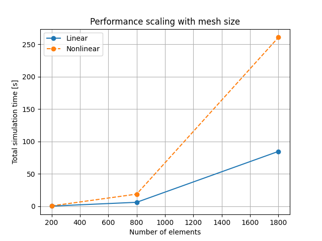
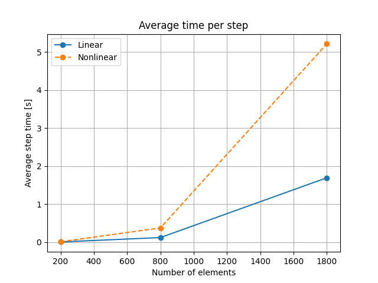
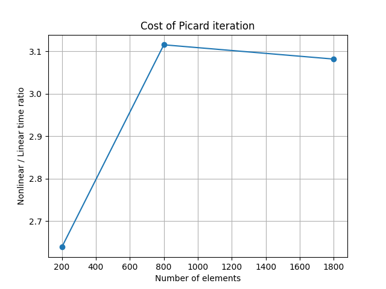

# Performance Study

## Objective

The objective of this study is to evaluate the computational performance of the FEM solver and its scalability with respect to mesh size. Additionally, the impact of nonlinear material modeling using Picard iteration is analyzed.

---

## Test Setup

Simulations were performed for three structured meshes:

| Mesh   | Nodes | Elements |
|--------|------|----------|
| 10x20  | 231  | 200      |
| 20x40  | 861  | 800      |
| 30x60  | 1891 | 1800     |

Each simulation was run in two modes:

- **Linear model** (constant material properties)
- **Nonlinear model** (temperature-dependent properties using Picard iteration)

Simulation parameters:

- Total simulation time: 500 s
- Time step: 10 s
- Number of steps: 50

---

## Results

### Total Simulation Time

The total simulation time increases rapidly with mesh size. A significant increase is observed when moving from 800 to 1800 elements.

---

### Average Time per Step

The average time per time step follows the same trend, confirming that the computational cost is dominated by the solution of the linear system at each step.

---

### Nonlinear Solver Cost

The nonlinear solver introduces an additional computational cost due to Picard iterations. The total simulation time for the nonlinear model is approximately 3 times higher than for the linear model.

---

## Analysis

The results indicate that the solver exhibits approximately cubic computational complexity with respect to the number of elements:

- Increasing the mesh size by a factor of 4 (200 → 800 elements) results in ~36× increase in computation time.
- Further increase to 1800 elements leads to another significant increase in runtime.

This behavior is consistent with the use of a direct Gaussian elimination solver, which has computational complexity of O(N³).

---

### Nonlinear Solver Behavior

The nonlinear simulations required on average:

- **~3 Picard iterations per time step**

This explains the observed ~3× increase in computational time compared to the linear model.

The convergence behavior is stable across all tested mesh sizes.

---

## Conclusions

- The computational cost is dominated by the linear system solver.
- The solver scales approximately with O(N³), which limits performance for large meshes.
- The nonlinear model introduces a predictable overhead proportional to the number of Picard iterations.
- For real-time applications, optimization of the linear solver is necessary.

---

## Future Work

- Replace Gaussian elimination with a more efficient solver (e.g., LU decomposition or iterative methods)
- Reduce system size or exploit sparsity
- Implement optimizations for real-time simulation mode