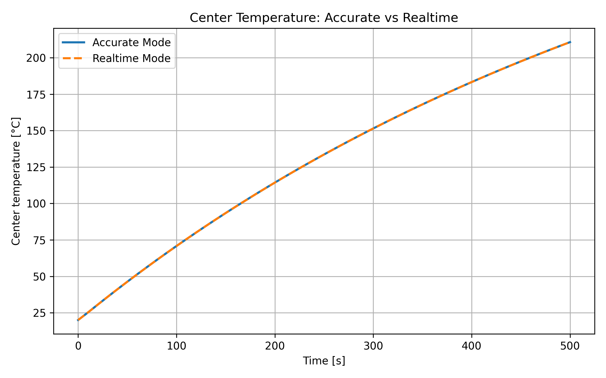
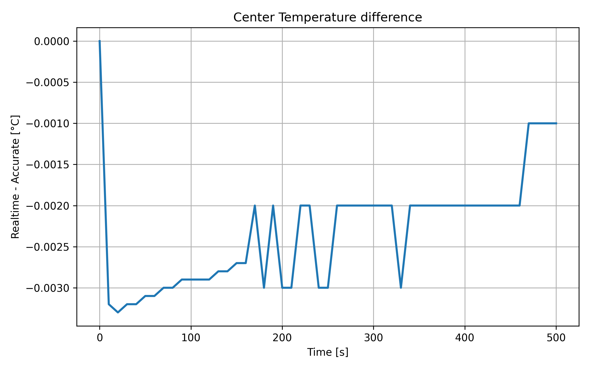
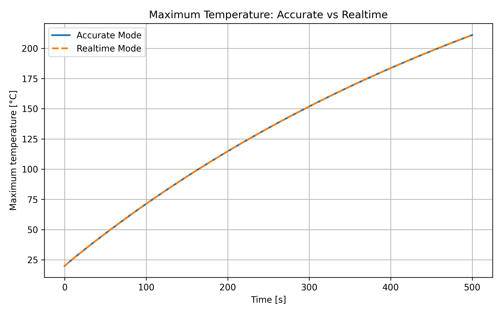

# Realtime Mode Comparison

## Objective

The objective of this study is to evaluate the accuracy and computational benefit of the proposed realtime simulation mode.

The realtime mode is compared against the accurate mode using the same physical problem, material model, boundary conditions and time discretization.

---

## Simulation Modes

### Accurate mode

- Mesh: 20x40
- Nonlinear material model: enabled
- Picard iteration: enabled
- Purpose: reference solution

### Realtime mode

- Mesh: 10x20
- Nonlinear material model: enabled
- Picard iteration: enabled
- Purpose: fast simulation with reduced computational cost

---

## Common Setup

- Axisymmetric cylindrical domain
- Transient heat conduction
- Convection on the outer cylindrical surface
- Temperature-dependent material properties: k(T), c(T)
- Total simulation time: 500 s
- Time step: 10 s
- Picard tolerance: 1e-3

---

## Compared Quantities

The following quantities were compared:

- temperature at the center of the cylinder
- maximum temperature in the domain
- difference between realtime and accurate center temperature

---

## Results

### Center temperature

### Center temperature difference

### Maximum temperature

---

## Discussion

The realtime mode uses a significantly coarser mesh than the accurate mode, reducing the number of elements and computational cost.

Despite the reduced spatial discretization, the obtained temperature histories remain nearly identical to the accurate reference solution. The maximum observed difference in center temperature was approximately 0.003 °C.

The realtime solution consistently produced slightly lower temperatures than the accurate mode. This behavior is expected due to increased numerical smoothing associated with a coarser mesh.

No numerical instability, divergence or oscillatory behavior was observed during the simulation.

---

## Conclusion

The developed realtime simulation mode provides a computationally efficient approximation of the accurate nonlinear FEM solution.

The comparison demonstrated that reducing the mesh density significantly decreases computation time while maintaining nearly identical temperature predictions. The maximum observed deviation between the realtime and accurate modes remained below 0.003 °C.

These results indicate that the simplified realtime configuration is suitable for fast thermal monitoring applications and future integration with experimental measurement systems.